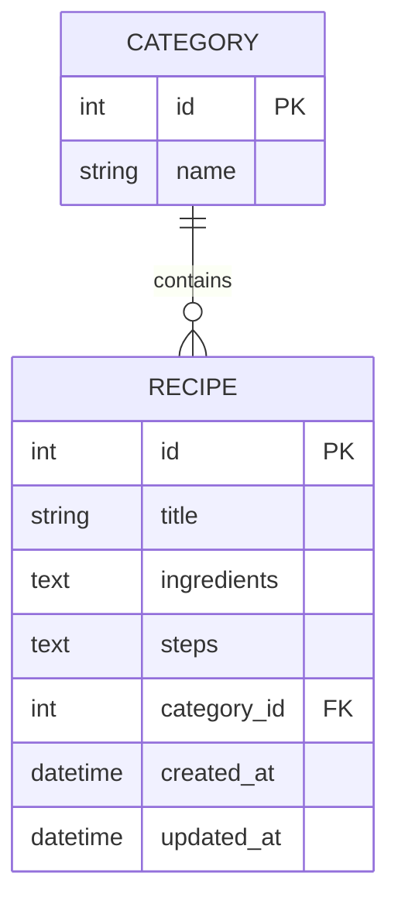

# 資料庫設計文件 (DB Design)

本文件根據產品需求與系統架構，定義「食譜收藏夾」的資料庫結構、實體關係圖 (ERD) 與資料表規格。

## 1. ER 圖 (實體關係圖)

## 2. 資料表詳細說明

### 2.1 Category (分類表)
負責儲存食譜的分類（例如：中式、西式、甜點等）。

| 欄位名稱 | 資料型別 | 屬性 | 說明 |
| :--- | :--- | :--- | :--- |
| `id` | INTEGER | Primary Key, Auto Increment | 分類唯一識別碼 |
| `name` | VARCHAR(50) | NOT NULL, UNIQUE | 分類名稱 |

### 2.2 Recipe (食譜表)
負責儲存食譜的核心資料，包含材料與作法。為了保持輕量，材料與作法採用 TEXT 型別儲存多行文字。

| 欄位名稱 | 資料型別 | 屬性 | 說明 |
| :--- | :--- | :--- | :--- |
| `id` | INTEGER | Primary Key, Auto Increment | 食譜唯一識別碼 |
| `title` | VARCHAR(100) | NOT NULL | 食譜標題 |
| `ingredients` | TEXT | NOT NULL | 材料清單 (多行純文字儲存) |
| `steps` | TEXT | NOT NULL | 作法步驟 (多行純文字儲存) |
| `category_id`| INTEGER | Foreign Key | 關聯至 Category 表的 id (可為空) |
| `created_at` | DATETIME | DEFAULT CURRENT_TIMESTAMP | 建立時間 |
| `updated_at` | DATETIME | DEFAULT CURRENT_TIMESTAMP | 最後更新時間 |

## 3. SQL 建表語法
完整的建表語法已產出並儲存於 `database/schema.sql`。

## 4. Python Model 程式碼
採用 SQLAlchemy ORM 撰寫的 Model 程式碼已產出並儲存於 `app/models.py`。
