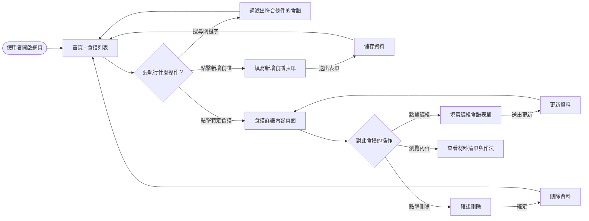
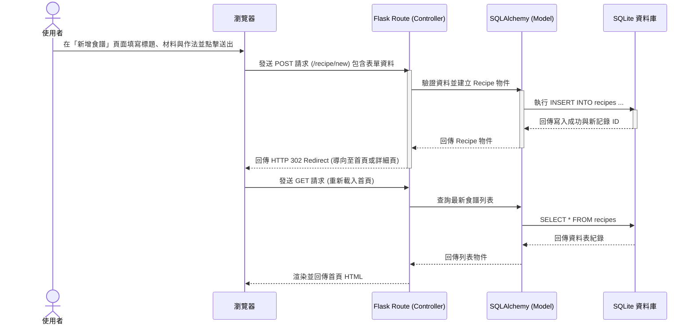

# 流程圖文件 (Flowchart)

本文件根據產品需求文件 (PRD) 與系統架構文件 (ARCHITECTURE)，定義「食譜收藏夾」系統的使用者操作路徑與系統資料流動方式。

## 1. 使用者流程圖 (User Flow)

此流程圖描述使用者在系統中可能進行的各種操作路徑，涵蓋食譜的瀏覽、新增、編輯、刪除以及搜尋。

## 2. 系統序列圖 (Sequence Diagram)

以下以「新增食譜」功能為例，展示從使用者填寫表單到資料庫寫入完成的完整系統互動過程：

## 3. 功能清單對照表

下表列出系統中的主要功能、對應的 URL 路徑規劃以及 HTTP 方法，為後續實作 API 設計與 Flask 路由的基礎。

| 功能名稱 | URL 路徑規劃 | HTTP 方法 | 說明 |
| :--- | :--- | :--- | :--- |
| **首頁 (食譜列表)** | `/` | GET | 顯示所有已收藏的食譜列表，若有加上 `?q=keyword` 則顯示搜尋結果。 |
| **新增食譜 (表單)** | `/recipe/new` | GET | 渲染新增食譜的 HTML 表單頁面。 |
| **新增食譜 (送出)** | `/recipe/new` | POST | 接收新增食譜的表單資料並存入資料庫。 |
| **食譜詳細資訊** | `/recipe/<id>` | GET | 顯示特定食譜的完整材料清單與作法。 |
| **編輯食譜 (表單)** | `/recipe/<id>/edit` | GET | 渲染編輯食譜的 HTML 表單頁面，並預填原有資料。 |
| **編輯食譜 (送出)** | `/recipe/<id>/edit` | POST | 接收編輯食譜的表單資料並更新至資料庫。 |
| **刪除食譜** | `/recipe/<id>/delete` | POST | 將特定食譜從資料庫中刪除 (通常透過表單送出 POST 請求)。 |
